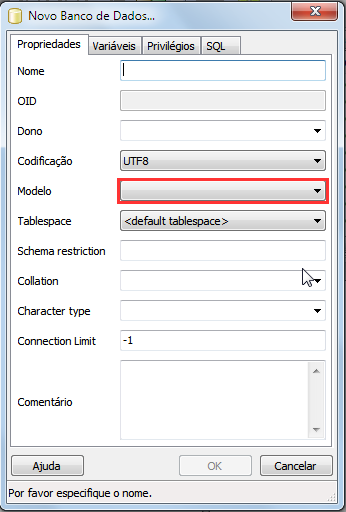

# PostGIS

* É uma extensão do _PostgreSQL_;

* Trabalha com dados geoespaciais;

* 100% compatível com a _OGC_;

* Suporta toda especificação _SFS_;

* Suporta rasters;

* Suporta topologia;

* Usa livrarias consagradas: _GEOS_ e _proj4_;

---

# _GEOS_

* _Geometry Engine Open Source_;

* Biblioteca geométrica;

* Escrita em C++;

* Trata com as questões relacionadas com distâncias, relações entre geometrias, etc;

---

# _proj4_

* Lida com as projeções e sistemas de referência;

* Escrita em C;

* Permite converter entre os vários _SRS_ (_Spatial Reference Systems_);

---

# Criar uma nova base de dados (windows)

* No caso do pgAdmin, existe uma combobox que permite escolher um *template*;



---

# Conversão de dados (shp2pgsql)

* A conversão de dados pode se dar de várias formas;

* Iremos mostrar uma muito simples, mas extremamente eficaz;

* shp2pgsql;

---

# shp2pgsql

* utilitário de linha de comando;

* converte um ficheiro .shp para .sql, que será usado na inserção dos dados;

* Faremos um teste com a nosso shape de estados (disponível no _github_);

---

# shp2pgsql #2

* escreva shp2pgsql no terminal e aparecerá uma lista das opções;

```bash
	shp2pgsql
	RCSID: $Id: shp2pgsql-core.h 5983 2010-09-19 11:27:05Z mcayland $ RELEASE: 1.5 USE_GEOS=1 USE_PROJ=1 USE_STATS=1
	USAGE: shp2pgsql [<options>] <shapefile> [<schema>.]<table>
	OPTIONS:
	  -s <srid>  Set the SRID field. Defaults to -1.
	  (-d|a|c|p) These are mutually exclusive options:
	      -d  Drops the table, then recreates it and populates
	          it with current shape file data.

	      -a  Appends shape file into current table, must be
	          exactly the same table schema.

	      -c  Creates a new table and populates it, this is the
	          default if you do not specify any options.

	      -p  Prepare mode, only creates the table.

	# corte
```

* vamos estudar a linha de comando;

---

# shp2pgsql - redirecionando a saída

* usar somente o comando shp2pgsql imprime os comandos sql na tela;

```bash
	shp2pgsql -W "LATIN1" municipios.shp
	SET CLIENT_ENCODING TO UTF8;
	SET STANDARD_CONFORMING_STRINGS TO ON;
	BEGIN;
	CREATE TABLE "municipios" (gid serial PRIMARY KEY,
	"name_2" varchar(75),
	"shape_leng" numeric,
	"shape_area" numeric);
	SELECT AddGeometryColumn('','municipios','the_geom','-1','MULTIPOLYGON',2);
	INSERT INTO "municipios" ("name_2","shape_leng","shape_area",the_geom) VALUES ('Abadia de Goiás','5.51822670213e-001','1.24798014466e-002','0106000000010000000103000000010000002E00000098CEFFBF32B948C0C00B00206AB730C068230060FEB648C0F0EE01E076B830C07875FF9F1DB648C0B044000098BB30C04038FF3F26B548C0E0E9FEDF48BC30C0F06DFFFFBCB448C0D09D0020ADBD30C0300901A05AB348C010C501400AC630C0D86300E04CB348C0F0790100C4C830C0F0F0FFBFFEB148C0E0ED018004CC30C018D6FF5F93B148C0B07601E0ECCF30C0B0AA00A009B248C0A0DB0120ECD230C0D8A6FFDF2AB148C00012FE7FFBD430C078C400A042B148C0703200A0FFD430C0B012FF1F43B148C0F06B0120F5D430C0388FFF9FD6B148C040ADFF1F19D530C060CBFF9FDBB448C0F0DF01A035DA30C02068006016B648C0E00A02A094DA30C0285A008007B748C0A0ECFF3F75DC30C070D2008011B848C0B08501202EDC30C0503F00201CBA48C0902EFFDF60DC30C068BDFFBFCCBA48C040B5FE7FE4DA30C0B078FFBF74BB48C09083016049D830C0F06DFFFFBCBA48C0C039FE5F03D330C0D06BFF3F18BD48C0D0120100E0CA30C0984BFFFF70BF48C0E0DBFEFFF9CA30C088330000B2C048C010B60100C9CD30C0A0C0FFDF23C148C01036FF7F81CD30C0B82700E0C7C148C0A03500C056CC30C098CEFFBFB2C348C000CFFE7F1DC930C0F86500A0F1C348C0C0BCFE1F05C730C07049FF3F4CC448C0A0D7FE7F30C730C0E86400403FC648C0F09F00E091C630C038120060D8C648C080DEFD7F89C530C0C0E500401CC548C01033014047C430C0505C00406CC548C0D0E0FF1F0BC030C018F3FF7F23C548C010B60100C9BE30C02085008066C448C0A0CFFF1F65BE30C07049FF3F0CC348C000C401E097BE30C0209CFF1F33C248C060FAFD3FA7BD30C06074FF3FEBC048C0006D018067BE30C088C50000F5C048C0308600E058BF30C048ED00E0BCBF48C0F02DFE3F99BF30C0B8B900E08ABE48C0F04E010065BC30C070AFFFDF7DBC48C00098018046BC30C030A3000029BC48C04081FFBF47BB30C0A0A3FFBF53B948C0805601A085B930C098CEFFBF32B948C0C00B00206AB730C0');
	#
	# corte
```

---

* podemos redirecionar a saída dos comandos para um arquivo!

```bash
	shp2pgsql -W "LATIN1" municipios.shp > municipio.sql
```

* assim criamos um arquivo .sql, pronto para uso!

---

# shp2pgsql - parâmetros default

* ```shp2pgsql [<options>] <shapefile> [<schema>.]<table>```

* o único parâmetro obrigatório é o shapefile;

* podemos especificar uma ou mais opções, ANTES de especificar qual é o shapefile;

* podemos escolher um nome de tabela ou *schema*. P nome da tabela não é obrigatório e o shp2pgsql tentará gerá-lo para nós;

---

# shp2pgsql - opções de criação

* -c cria nova tabela (default, não é necessário);

```bash
	shp2pgsql -W "LATIN1" municipios.shp
	SET CLIENT_ENCODING TO UTF8;
	SET STANDARD_CONFORMING_STRINGS TO ON;
	BEGIN;
	CREATE TABLE "municipios" (gid serial PRIMARY KEY,
	"name_2" varchar(75),
	"shape_leng" numeric,
	"shape_area" numeric);
	SELECT AddGeometryColumn('','municipios','the_geom','-1','MULTIPOLYGON',2);
	INSERT INTO "municipios" ("name_2","shape_leng","shape_area",the_geom) VALUES ('Abadia de Goiás','5.51822670213e-001','1.24798014466e-002','0106000000010000000103000000010000002E00000098CEFFBF32B948C0C00B00206AB730C068230060FEB648C0F0EE01E076B830C07875FF9F1DB648C0B044000098BB30C04038FF3F26B548C0E0E9FEDF48BC30C0F06DFFFFBCB448C0D09D0020ADBD30C0300901A05AB348C010C501400AC630C0D86300E04CB348C0F0790100C4C830C0F0F0FFBFFEB148C0E0ED018004CC30C018D6FF5F93B148C0B07601E0ECCF30C0B0AA00A009B248C0A0DB0120ECD230C0D8A6FFDF2AB148C00012FE7FFBD430C078C400A042B148C0703200A0FFD430C0B012FF1F43B148C0F06B0120F5D430C0388FFF9FD6B148C040ADFF1F19D530C060CBFF9FDBB448C0F0DF01A035DA30C02068006016B648C0E00A02A094DA30C0285A008007B748C0A0ECFF3F75DC30C070D2008011B848C0B08501202EDC30C0503F00201CBA48C0902EFFDF60DC30C068BDFFBFCCBA48C040B5FE7FE4DA30C0B078FFBF74BB48C09083016049D830C0F06DFFFFBCBA48C0C039FE5F03D330C0D06BFF3F18BD48C0D0120100E0CA30C0984BFFFF70BF48C0E0DBFEFFF9CA30C088330000B2C048C010B60100C9CD30C0A0C0FFDF23C148C01036FF7F81CD30C0B82700E0C7C148C0A03500C056CC30C098CEFFBFB2C348C000CFFE7F1DC930C0F86500A0F1C348C0C0BCFE1F05C730C07049FF3F4CC448C0A0D7FE7F30C730C0E86400403FC648C0F09F00E091C630C038120060D8C648C080DEFD7F89C530C0C0E500401CC548C01033014047C430C0505C00406CC548C0D0E0FF1F0BC030C018F3FF7F23C548C010B60100C9BE30C02085008066C448C0A0CFFF1F65BE30C07049FF3F0CC348C000C401E097BE30C0209CFF1F33C248C060FAFD3FA7BD30C06074FF3FEBC048C0006D018067BE30C088C50000F5C048C0308600E058BF30C048ED00E0BCBF48C0F02DFE3F99BF30C0B8B900E08ABE48C0F04E010065BC30C070AFFFDF7DBC48C00098018046BC30C030A3000029BC48C04081FFBF47BB30C0A0A3FFBF53B948C0805601A085B930C098CEFFBF32B948C0C00B00206AB730C0');
	#
	# corte
```

---

* -a append nos dados - este comando só será bem sucedido. Note a falta do comando CREATE TABLE;

```bash
	shp2pgsql -a -W "LATIN1" municipios.shp > municipio.sql
	SET CLIENT_ENCODING TO UTF8;
	SET STANDARD_CONFORMING_STRINGS TO ON;
	BEGIN;
	INSERT INTO "municipios" ("name_2","shape_leng","shape_area",the_geom) VALUES ('Abadia de Goiás','5.51822670213e-001','1.24798014466e-002','0106000000010000000103000000010000002E00000098CEFFBF32B948C0C00B00206AB730C068230060FEB648C0F0EE01E076B830C07875FF9F1DB648C0B044000098BB30C04038FF3F26B548C0E0E9FEDF48BC30C0F06DFFFFBCB448C0D09D0020ADBD30C0300901A05AB348C010C501400AC630C0D86300E04CB348C0F0790100C4C830C0F0F0FFBFFEB148C0E0ED018004CC30C018D6FF5F93B148C0B07601E0ECCF30C0B0AA00A009B248C0A0DB0120ECD230C0D8A6FFDF2AB148C00012FE7FFBD430C078C400A042B148C0703200A0FFD430C0B012FF1F43B148C0F06B0120F5D430C0388FFF9FD6B148C040ADFF1F19D530C060CBFF9FDBB448C0F0DF01A035DA30C02068006016B648C0E00A02A094DA30C0285A008007B748C0A0ECFF3F75DC30C070D2008011B848C0B08501202EDC30C0503F00201CBA48C0902EFFDF60DC30C068BDFFBFCCBA48C040B5FE7FE4DA30C0B078FFBF74BB48C09083016049D830C0F06DFFFFBCBA48C0C039FE5F03D330C0D06BFF3F18BD48C0D0120100E0CA30C0984BFFFF70BF48C0E0DBFEFFF9CA30C088330000B2C048C010B60100C9CD30C0A0C0FFDF23C148C01036FF7F81CD30C0B82700E0C7C148C0A03500C056CC30C098CEFFBFB2C348C000CFFE7F1DC930C0F86500A0F1C348C0C0BCFE1F05C730C07049FF3F4CC448C0A0D7FE7F30C730C0E86400403FC648C0F09F00E091C630C038120060D8C648C080DEFD7F89C530C0C0E500401CC548C01033014047C430C0505C00406CC548C0D0E0FF1F0BC030C018F3FF7F23C548C010B60100C9BE30C02085008066C448C0A0CFFF1F65BE30C07049FF3F0CC348C000C401E097BE30C0209CFF1F33C248C060FAFD3FA7BD30C06074FF3FEBC048C0006D018067BE30C088C50000F5C048C0308600E058BF30C048ED00E0BCBF48C0F02DFE3F99BF30C0B8B900E08ABE48C0F04E010065BC30C070AFFFDF7DBC48C00098018046BC30C030A3000029BC48C04081FFBF47BB30C0A0A3FFBF53B948C0805601A085B930C098CEFFBF32B948C0C00B00206AB730C0');
	#
	# corte
```

---

* -d drop (apaga uma tabela de mesmo nome) a tabela antiga antes de criá-la novamente - note o comando de drop column e drop table;

```bash
	shp2pgsql -d -W "LATIN1" municipios.shp > data/municipio.sql
	SET CLIENT_ENCODING TO UTF8;
	SET STANDARD_CONFORMING_STRINGS TO ON;
	SELECT DropGeometryColumn('','municipios','the_geom');
	DROP TABLE "municipios";
	BEGIN;
	CREATE TABLE "municipios" (gid serial PRIMARY KEY,
	"name_2" varchar(75),
	"shape_leng" numeric,
	"shape_area" numeric);
	SELECT AddGeometryColumn('','municipios','the_geom','-1','MULTIPOLYGON',2);
	INSERT INTO "municipios" ("name_2","shape_leng","shape_area",the_geom) VALUES ('Abadia de Goiás','5.51822670213e-001','1.24798014466e-002','0106000000010000000103000000010000002E00000098CEFFBF32B948C0C00B00206AB730C068230060FEB648C0F0EE01E076B830C07875FF9F1DB648C0B044000098BB30C04038FF3F26B548C0E0E9FEDF48BC30C0F06DFFFFBCB448C0D09D0020ADBD30C0300901A05AB348C010C501400AC630C0D86300E04CB348C0F0790100C4C830C0F0F0FFBFFEB148C0E0ED018004CC30C018D6FF5F93B148C0B07601E0ECCF30C0B0AA00A009B248C0A0DB0120ECD230C0D8A6FFDF2AB148C00012FE7FFBD430C078C400A042B148C0703200A0FFD430C0B012FF1F43B148C0F06B0120F5D430C0388FFF9FD6B148C040ADFF1F19D530C060CBFF9FDBB448C0F0DF01A035DA30C02068006016B648C0E00A02A094DA30C0285A008007B748C0A0ECFF3F75DC30C070D2008011B848C0B08501202EDC30C0503F00201CBA48C0902EFFDF60DC30C068BDFFBFCCBA48C040B5FE7FE4DA30C0B078FFBF74BB48C09083016049D830C0F06DFFFFBCBA48C0C039FE5F03D330C0D06BFF3F18BD48C0D0120100E0CA30C0984BFFFF70BF48C0E0DBFEFFF9CA30C088330000B2C048C010B60100C9CD30C0A0C0FFDF23C148C01036FF7F81CD30C0B82700E0C7C148C0A03500C056CC30C098CEFFBFB2C348C000CFFE7F1DC930C0F86500A0F1C348C0C0BCFE1F05C730C07049FF3F4CC448C0A0D7FE7F30C730C0E86400403FC648C0F09F00E091C630C038120060D8C648C080DEFD7F89C530C0C0E500401CC548C01033014047C430C0505C00406CC548C0D0E0FF1F0BC030C018F3FF7F23C548C010B60100C9BE30C02085008066C448C0A0CFFF1F65BE30C07049FF3F0CC348C000C401E097BE30C0209CFF1F33C248C060FAFD3FA7BD30C06074FF3FEBC048C0006D018067BE30C088C50000F5C048C0308600E058BF30C048ED00E0BCBF48C0F02DFE3F99BF30C0B8B900E08ABE48C0F04E010065BC30C070AFFFDF7DBC48C00098018046BC30C030A3000029BC48C04081FFBF47BB30C0A0A3FFBF53B948C0805601A085B930C098CEFFBF32B948C0C00B00206AB730C0');
	#
	# corte
```

---

* -p cria somente o contentor, neste caso, somente a tabela e suas colunas - não existem dados importados neste ficheiro;

```bash
	shp2pgsql -p -W "LATIN1" municipios.shp > municipio.sql
	SET CLIENT_ENCODING TO UTF8;
	SET STANDARD_CONFORMING_STRINGS TO ON;
	BEGIN;
	CREATE TABLE "municipios" (gid serial PRIMARY KEY,
	"name_2" varchar(75),
	"shape_leng" numeric,
	"shape_area" numeric);
	SELECT AddGeometryColumn('','municipios','the_geom','-1','MULTIPOLYGON',2);
	COMMIT;
	#
	# fim do arquivo
```

* estas opções são _mutualmente_ exclusivas, ou seja, só podemos usar uma de cada vez;

---

# shp2pgsql - encoding

* a opção -W determina qual será o *encoding* de origem dos dados.

* esta opção é importante para lermos os dados corretamente e não recebermos caracteres estranhos
na nossa base de dados;

* para utilizar esta opção, usamos o _switch_ -W e a especificação do encoding (equivalente ao _PostgreSQL_).

* *encodings* válidos e mais comuns: UTF-8 (default), LATIN1, WIN1252 (obsoleto);

---

# shp2pgsql - srid

* permite especificar o SRID de origem;

* permite especificar um SRID de origem e um de destino;

* -s especifica qual é o SRID de entrada da tabela. Note que nenhuma conversão é feita neste momento, apenas especifica o SRID.

```bash
	shp2pgsql -s 4291 -W "LATIN1" municipios.shp > municipio.sql
	SET CLIENT_ENCODING TO UTF8;
	SET STANDARD_CONFORMING_STRINGS TO ON;
	BEGIN;
	CREATE TABLE "municipios" (gid serial PRIMARY KEY,
	"name_2" varchar(75),
	"shape_leng" numeric,
	"shape_area" numeric);
	SELECT AddGeometryColumn('','municipios','the_geom',4291,'MULTIPOLYGON',2);
	#
	# corte
```

---

# shp2pgsql - reprojetando automaticamente

* Use a opção -s com o formato ```-s DE_SRID>PARA_SRID```;

* Não funciona no formato dump binário do _PostgreSQL_;

```bash
	shp2pgsql -s 4291>4326 -W "LATIN1" municipios.shp > municipio.sql
	SET CLIENT_ENCODING TO UTF8;
	SET STANDARD_CONFORMING_STRINGS TO ON;
	BEGIN;
	CREATE TABLE "municipios" (gid serial PRIMARY KEY,
	"name_2" varchar(75),
	"shape_leng" numeric,
	"shape_area" numeric);
	SELECT AddGeometryColumn('','municipios','the_geom',4326,'MULTIPOLYGON',2);
	#
	# corte
```

---

# shp2pgsql - outras opções

* -I : cria um índice geoespacial na coluna;

* -g "nome_coluna" : escolhe o nome da coluna que receberá os dados geoespaciais;

* -w : usa o formato WKT para construção das geometrias (ex: 'POINT(-12.1 -24.4)') - aviso: este _switch_ é útil, mas ele pode introduzir pequenas mudanças nas geometrias, devido ao arredondamento e ele dropa os valores M;

* -D : gera a saída como um dump do _PostgreSQL_;

* -t <valor> : Força a saída da geometria em determinada dimensionalidade (2d, 3d, 4d);

---

# shp2pgsql - exercícios

* vamos importar os dados de municipios, como nos exemplos acima.

* gere um arquivo sql. use as opções -s e -W para configurar corretamente o sistema de referência e o encoding;

* coloque o na pasta ```/home/george/Desktop/curso-postgis/src/exericios/aula01/```;

---

# shp2pgsql - carga

* o utilitário não carrega nada na base de dados. ele apenas gera os dados em formato .sql;

* para carga, usaremos o utilitário psql (ou o pgAdmin 3 - o que você preferir);

```bash
sudo postgres
# insira sua senha :D
psql -d curso_postgis -f /home/george/Desktop/curso-postgis/src/exercicios/aula01/municipios.sql
```

---


# pgsql2shp

* da mesma forma que temos um importador disponível, temos um exportador;

* funciona de forma análoga ao importador: é um utilitário de linha de comando que pode exportar tabelas para shapefile;


# Construção de tabelas geoespaciais

* importar dados shapefile é apenas uma parte do trabalho;

* construir tabelas novas é tão simples quanto importar os dados;

* para isso usamos o psql ou o pgAdmin 3 - conectem à base curso_postgis pela ferramenta da sua preferência;

* iremos criar uma tabela de pontos para armazenar as sedes municipais;

```sql
CREATE TABLE sede_municipal (
id SERIAL PRIMARY KEY,
nome varchar(128) NOT NULL,
geometria GEOMETRY NOT NULL
);
```

---

# Construção de tabelas geoespaciais - forma simples, mas 'errada'

* esta é uma forma de criar uma tabela. mas existem desvantagens com esta perspectiva;

```sql
-- inserir um ponto
INSERT INTO sede_municipal (id,nome,geometria) VALUES (DEFAULT,'olá mundo',ST_GeomFromText('POINT(0 0)'));

-- inserir uma linha, hey espere, estamos falando de pontos!
INSERT INTO sede_municipal (id,nome,geometria) VALUES (DEFAULT,'linha',ST_GeomFromText('LINESTRING(0 0,1 1)'));
```

* ao executarmos este comando, inserimos duas novas sedes, uma de pontos e uma de linha;

* o PostGIS, por default, não força o utilozador a armazenar sempre o mesmo tipo de geometria na coluna.

---

# Construção de tabelas geoespaciais - forma simples, mas 'errada'

* Nem o PostGIS e nem o _PostgreSQL_ irão reclamar destas questões, mas outros softwares irão. O Quantum GIS, não saberá como mostrar esta tabela de forma correta;

```sql
SELECT *, ST_AsText(geometrias) FROM sede_municipal;
-- 1;"olá mundo";"010100000000000000000000000000000000000000";"POINT(0 0)"
-- 2;"linha";"01020000000200000000000000000000000000000000000000000000000000F03F000000000000F03F";"LINESTRING(0 0,1 1)"
```

* esta coluna não tem SRID definido;

* forma correta de criação de colunas geoespaciais é através de uma função, que além de adicionar a coluna, adiciona três restrições à entrada dos dados;

* Tipo da geometria deve ser único; Geometrias de tipos diferentes do especificado serão barrados;

* Restrição de SRID. Geometrias de SRID diferentes serão barrados;

* Geometrias com um número de dimensões diferente serão barradas;

---

# Construção de tabelas geoespaciais - mais chato, mas 100% correto

```sql
DROP TABLE sede_municipal;
CREATE TABLE sede_municipal (
id SERIAL PRIMARY KEY,
nome VARCHAR(128) NOT NULL
);

-- parametros: schema, tabela, nome coluna geoespacial, srid, tipo geometria e número de dimensões
SELECT * FROM AddGeometryColumn('public','sede_municipal','geometria',4291,'POINT',2);
-- "public.sede_municipal.geometria SRID:4291 TYPE:POINT DIMS:2 "
```

* agora vamos tentar inserir dados, como antes;

---

# Dados corretos, com SRID e o número correto de dimensões

```sql
-- ok, funciona
INSERT INTO sede_municipal (id,nome,geometria) VALUES (DEFAULT,'olá mundo cruel',ST_SetSRID(ST_GeomFromText('POINT(0 0)'),4291));
```

---

# Dados incorretos, não temos SRID

```sql
-- não funciona, não temos SRID
INSERT INTO sede_municipal (id,nome,geometria) VALUES (DEFAULT,'olá mundo cruel',ST_GeomFromText('POINT(0 0)'));
-- ERRO:  novo registro da relação "sede_municipal" viola restrição de verificação "enforce_srid_geometria"
```

---

# Dados incorretos, número de dimensões acima do especificado

```sql
INSERT INTO sede_municipal (id,nome,geometria) VALUES (DEFAULT,'olá mundo cruel',ST_SetSRID(ST_GeomFromEWKT('POINT(0 0 0)'),4291));
-- ERRO:  novo registro da relação "sede_municipal" viola restrição de verificação "enforce_dims_geometria"
```

---

# Dados incorretos, tipo errado

```sql
INSERT INTO sede_municipal (id,nome,geometria) VALUES (DEFAULT,'olá mundo cruel',ST_SetSRID(ST_GeomFromText('LINESTRING(0 0,1 1)'),4291));
-- ERRO:  novo registro da relação "sede_municipal" viola restrição de verificação "enforce_geotype_geometria"
```

* Quando modelar uma nova tabela que use colunas geoespaciais, (quase) sempre use a função _AddGeometryColumn_!!!

---

# Construção de tabelas geoespaciais - quando o sempre não é sempre?

* Quando não usar a função AddGeometryColumn?

* Camadas que não serão diretamente visíveis em _softwares_ GIS (QuantumGIS, ArcGIS, MapServer, etc);

* Geralmente quando temos um sistema que controla a flexibilidade que isto permite;

---

# Construção de tabelas geoespaciais - exercícios

* Crie uma tabela chamada sede_municipio;

* Utilize a função ST_GeomFromText para inserir alguns pontos na tabela;

* Esta função aceita uma string (delimitada por aspas simples) e aceita o formato POINT(x y);

* Coloque o script que completo na pasta ```/home/george/Desktop/curso-postgis/exercicios/aula01/construcao-tabela-geo/```;


---

# Tabelas/views especiais

* O PostGIS armazena algumas informações importantes. Metadados, caso prefira;

* São informações sobre as tabelas e colunas geoespaciais na base de dados.

* Porque?

* Otimizações;

* Suporte a softwares externos;

* Dados estáticos importantes (sistemas de referência);

---

# geometry_columns

```sql
	SELECT * FROM geometry_columns;
```

<table>
	<tr>
		<th>
			f_table_catalog
		</th>
		<th>
			f_table_schema
		</th>
		<th>
			f_table_name
		</th>
				<th>
			f_geometry_column
		</th>
		<th>
			f_coord_dimension
		</th>
		<th>
			srid
		</th>
		<th>
			type
		</th>
	</tr>
	<tr>
		<td>
			
		</td>
		<td>
			public
		</td>
		<td>
			sede_municipal
		</td>
		<td>
			the_geom
		</td>
		<td>
			2
		</td>
		<td>
			-1
		</td>
		<td>
			POINT
		</td>
	</tr>
</table>

---

# geography_columns

```sql
	SELECT * FROM geography_columns;
```

<table>
	<tr>
		<th>
			f_table_catalog
		</th>
		<th>
			f_table_schema
		</th>
		<th>
			f_table_name
		</th>
				<th>
			f_geography_column
		</th>
		<th>
			f_coord_dimension
		</th>
		<th>
			srid
		</th>
		<th>
			type
		</th>
	</tr>
</table>

Tabela vazia


```sql
	CREATE TABLE teste_geography (
		id SERIAL PRIMARY KEY,
		nome VARCHAR(128) NOT NULL,
		geografia GEOGRAPHY(POINT,4326) NOT NULL
	);

	SELECT * FROM geography_columns;
```
<table>
	<tr>
		<th>
			f_table_catalog
		</th>
		<th>
			f_table_schema
		</th>
		<th>
			f_table_name
		</th>
				<th>
			f_geography_column
		</th>
		<th>
			f_coord_dimension
		</th>
		<th>
			srid
		</th>
		<th>
			type
		</th>
	</tr>
	<tr>
		<td>
			curso_postgis
		</td>
		<td>
			public
		</td>
		<td>
			teste_geography
		</td>
		<td>
			geografia
		</td>
		<td>
			2
		</td>
		<td>
			4326
		</td>
		<td>
			POINT
		</td>
	</tr>
</table>

* falaremos mais sobre colunas geográficas no próximo tópico!

---

# spatial_ref_sys

```sql
	SELECT * FROM spatial_ref_sys WHERE srtext LIKE '%SAD69%';
```
<table>
	<tr>
		<th>
			srid
		</th>
		<th>
			auth_name
		</th>
		<th>
			auth_srid
		</th>
		<th>
			srtext
		</th>
		<th>
			proj4text
		</th>
	</tr>
	<tr>
		<td>
			4291
		</td>
		<td>
			EPSG
		</td>
		<td>
			4291
		</td>
		<td>
			GEOGCS["SAD69",DATUM["South_American_Datum_1969",(...)
		</td>
		<td>
			+proj=longlat +ellps=GRS67 +towgs84=-57,1,-41,0,0,0,0 +no_defs
		</td>
	</tr>
	<tr>
		<td>
			4618
		</td>
		<td>
			EPSG
		</td>
		<td>
			4618
		</td>
		<td>
			GEOGCS["SAD69",DATUM["South_American_Datum_1969",(...)
		</td>
		<td>
			+proj=longlat +ellps=aust_SA +towgs84=-57,1,-41,0,0,0,0 +no_defs
		</td>
	</tr>
</table>

---

# Exercícios para a semana

## [Exercícios Topico I](https://github.com/joa-quim/bdg/blob/master/exercicios/exercicios_aula01)
