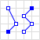
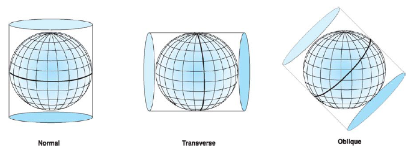

Tópico 2 - Primeiros Passos
=================================================


# Tipos geométricos;

* Ponto (_POINT_);

* Linha (_LINESTRING_);

* Polígono (_POLYGON_);

* Multi* (_MULTIPOINT_,_MULTILINESTRING_,_MULTIPOLYGON_,etc);

* Outros tipos

	* Topology (_TOPOGEOM_);

	* Raster (_RASTER_);

	* PolyhedralSurface (_POLYHEDRALSURFACE_,_POLYHEDRALSURFACECEM_);

	* CircularString (_CIRCULARSTRING_);

---

# Dimensionalidade

* A dimensionalidade de uma geometria é o número de informações que podemos derivar da mesma;

* Pontos são zero dimensionais (não possuem volume, área ou perímetro);

* Linhas são unidimensionais (possuem comprimento);

* Polígonos ou áreas são bidimensionais (possuem perímetro e área);

* Esta noção de dimensionalidade é importante quando falarmos de relações espaciais;

---

# POINT

* Possui a dimensionalidade 0;

* Construtores comuns:

```sql
SELECT ST_AsText(ST_MakePoint(0,0));

SELECT ST_AsEWKT(ST_MakePoint(0,0,0));

SELECT ST_AsEWKT(ST_MakePoint(0,0,0,0));

SELECT ST_GeomFromText('POINT(0 0)',4326);
```


Fonte: http://en.wikipedia.org/wiki/Well-known_text

# LINESTRING

* Possui dimensionalidade 1 (comprimento);

* Construtores comuns:

```sql
SELECT ST_AsText(
	ST_MakeLine(ST_MakePoint(0,0),
				ST_MakePoint(1,1)));

SELECT ST_AsText(
	ST_MakeLine(ARRAY[
		ST_MakePoint(0,0),
		ST_MakePoint(1,1),
		ST_MakePoint(2,0)
	]));

SELECT ST_AsText(
	ST_GeomFromText('LINESTRING(0 0,1 1,2 0)'));
```


Fonte: http://en.wikipedia.org/wiki/Well-known_text

---

# POLYGON

* Possui dimensionalidade 2 (comprimento e área);

* Construtores comuns:

```sql
-- polígono, utilizando MakeLine e MakePoint
SELECT ST_AsText(
	ST_MakePolygon(
		ST_MakeLine(ARRAY[
			ST_MakePoint(0,0),
			ST_MakePoint(0,1),
			ST_MakePoint(1,1),
			ST_MakePoint(1,0),
			ST_MakePoint(0,0)])
	));

-- polígono, utilizando GeomFromText
SELECT ST_AsText(
	ST_MakePolygon(
		ST_GeomFromText('LINESTRING(0 0, 0 1, 1 1, 1 0, 0 0)')));

-- polígono como buracos
SELECT ST_AsText(
	ST_MakePolygon(
		ST_GeomFromText('LINESTRING(0 0, 0 1, 1 1, 1 0, 0 0)'),
		ARRAY[
			ST_GeomFromText('LINESTRING(0.5 0.5, 0.5 0.6, 0.6 0.6, 0.6 0.5, 0.5 0.5)')]));
```


Fonte: http://en.wikipedia.org/wiki/Well-known_text

---

# MULTIPOINT

```sql
SELECT ST_AsText(ST_GeomFromText('MULTIPOINT(0 0, 1 1, 2 2, 3 3)'));
```


Fonte: http://en.wikipedia.org/wiki/Well-known_text

---

# MULTILINESTRING

```sql
SELECT ST_AsText(ST_GeomFromText('MULTILINESTRING((0 0, 1 1, 2 2, 3 3),(2 1, 3 4, 5 1))'));
```



Fonte: http://en.wikipedia.org/wiki/Well-known_text

---

# MULTIPOLYGON

```sql
SELECT ST_AsText(
	ST_GeomFromText('MULTIPOLYGON(((0 0,0 1,1 1,1 0,0 0),(6 6,6 7,7 7,7 6,6 6)))'))
```


Fonte: http://en.wikipedia.org/wiki/Well-known_text

---

# BBOX

* É um tipo de representação simples da geometria de um objeto;

* BBOX = Bounding Box = Envelope = Mínimo Retângulo Envolvente (existem várias terminologias por aí);

* Armazena as coordenadas mínimas e máximas de cada geometria;

```sql
	SELECT Box2D(ST_GeomFromText('LINESTRING(0 0,1 1)'));
	-- "BOX(0 0,1 1)"
```

* Toda geometria possui uma BBOX;

* A BBOX de um ponto é o próprio ponto;

```sql
	SELECT Box2D(ST_GeomFromText('POINT(0 0)'));
	-- "BOX(0 0,0 0)"
```

* São utilizadas por índices para filtrar e resolver relacionamentos geoespaciais - é muito mais fácil testar se um ponto está dentro de uma BBOX do que testar se o ponto está dentro de um polígono complexo;

* Agiliza a vida :D;


---

# Sistemas de Referência;

* O que são sistemas de referência?

	* Formas de representar a superfície de um objeto ("meio") esférico em um plano;

	* Sistema de coordenadas + Datum + Projeção;

* Sistemas de coordenadas

	* Geográficos;

	* Projectados;

---

# Sistema de coordenadas geográficos

* São definidos numa superfície "esférica";

* Utiliza medidas angulares para determinar a posição de algo na "esfera";

* Utilizamos os termos _latitude_ e _longitude_ para localizar a posição;

* _Latitude_ refere-se ao ângulo entre o equador e um paralelo;

* _Longitude_ refere-se ao ângulo entre o meridiano central (_geralmente_ Greenwhich) e um meridiano;


Fonte: ESRI (Understanding Map Projections)

---

# Sistema de coordenadas geográficos - um lembrete

* Na _Cartografia_ convenciou-se nomear as coordendas geográficas como _latitude_,_longitude_;

* Nem sempre será assim em todos os pacotes de _softwares_.

* **latitude = y**

* **longitude = x**

* Este sistema de coordenadas não mantém as distâncias. Ou seja, o valor de 1 grau de latitude no equador é diferente de 1 grau de latitude no paralelo 40N;

---

# Superfície do sistema geográfico

* É determinada por uma esfera ou um elipsóide;

* A forma da Terra assemelha-se mais a um elipsóide, mas muitos cálculos são executados como se ela fosse uma esfera (mapas de pequenas escala, ou seja 1:5.000.000 ou menor);

* Escalas maiores (menor que 1:1.000.000) requerem o uso do elipsóide;


Fonte: ESRI (Understanding Map Projections)

* Uma esfera é baseada num círculo (possui e semieixo maior = semieixo menor);

* Um elipsóide é baseado numa elipse (valores diferentes dos semieixos maior e menor);

* Cada região da crosta terrestre ajusta-se bem a um determinado elipsóide;

---

# Datums

* O elipsóide aproxima a forma da Terra;

* O datum (plural: data) é responsável por posicionar o elipsóide, relativo ao centro da Terra;

* Podemos ter várias medições (coordenadas) para uma mesma posição, de acordo com o datum escolhido;


Fonte: ESRI (Understanding Map Projections)

---

# Sistema de coordenadas projectados

* São sistemas definidos numa superfície plana;

* São sempre baseados num sistema geográfico;

* Portanto, são baseados numa esfera ou elipsóide;

* As coordenadas são dadas por posições x,y, como num gráfico na matemática;

* Origem: x = 0, y = 0;

---

# Transformando para o plano

* Operação comumente chamada de projecção;

* Projecção altera as propriedades espaciais;

* Imagine uma quadrícula em cima de uma laranja. Corte a casca da laranja e abra a mesma,
  até ela ficar plana. Os quadradinhos continuam quadradinhos?


Fonte: ESRI (Understanding Map Projections)

* Projecção significa distorção!;


Fonte: ESRI (Understanding Map Projections)

* Projecções diferentes significam distorções distintas;

* Projecções conformes mantém a forma;

* Projecções equidistantes mantém a distância;

* Projecções azimutais mantém os ângulos;

* Projecções equivalentes mantém a área;

---

# Tipos comuns de projecção

* Cilíndricas (UTM);



Fonte: ESRI (Understanding Map Projections)

* Planas


Fonte: ESRI (Understanding Map Projections)

* Outros tipos


Fonte: ESRI (Understanding Map Projections)

---

# Qual é a projecção mais adequada para o meu projeto?

* Depende. Varia **muito**;

* Qual é a área da aplicação (cartográfica, não computacional)?

	* Quanto menor a área, mais fácil se torna lidar com os dados num sistema projectado;

	* Quanto maior a área, maiores são as distorções exibidas, portanto, um sistema geográfico é melhor;

	* Existem exceções as duas "regras" acima;

---

# Como definir um sistema de referência

* Lembra-se da tabela spatial_ref_sys?

* Insira um registro com as informações do seu sistema nesta tabela e está pronto;

* Onde encontro estas informações?

[Spatial Reference](http://spatialreference.org/)

# Como converter entre sistemas de referência?

* Os dados já devem ter um sistema de referência. Não é possível converter um dado geoespacial com sistema de referência ```nulo``` para outro sistema;

* Utilize a função ```ST_Transform```; 

```sql
SELECT ST_AsText(ST_Transform(ST_GeomFromText('POINT(-47.9 -15.70)',4326),31983));
-- "POINT(189151.648254912 8262118.43615328)"
```

* Caso a tabela ```spatial_ref_sys``` não possua o SRID que desejado a conversão falhará!

```sql
SELECT ST_AsText(ST_Transform(ST_GeomFromText('POINT(-47.9 -15.70)',4674),1));
-- ERRO:  GetProj4StringSPI: Cannot find SRID (1) in spatial_ref_sys
```

---

# Geometry;

* Tipo geoespacial mais comum;

* Amplo suporte de outros _softwares_;

* Faz todos os cálculos no plano (mesmo quando se trata de sistemas de referência geográficos);

* O caminho mais curto entre dois pontos é uma reta;

# Geography

* Menos funcionalidade disponível (os cálculos são bem mais complexos);

* Trabalha no elipsóide;

* O caminho mais curto entre dois pontos é um grande arco;

* Só suporta o sistema de referência WGS84 (SRID 4326);

* Tipos geométricos suportados: _POINT_,_LINESTRING_,_POLYGON_, e _MULTIs_ dos tipos especificados anteriormente;

* Unidade padrão de pesquisa: **metros**;

# Quando usar geography?

* Este tipo é mais preciso para ser utilizado quando grandes distâncias estão envolvidas;

* Calcular a distância entre duas cidades muito distantes é quando este tipo realmente faz a diferença:

```sql
-- distância entre seattle e Reykjavik usando geography
SELECT ST_Distance('POINT(-122.33 47.606)'::geography, 'POINT(-21.96 64.15)':: geography);

-- distância entre seattle e Reykjavik, usando geometry
SELECT ST_Distance('POINT(-122.33 47.606)'::geometry, 'POINT(-21.96 64.15)':: geometry);
```

* Para fazer o mesmo cálculo com o tipo _GEOMETRY_, seria necessário primeiro converter os
  dados do sistema de um sistema de referência geográfico para um sistema projetado, para
  depois calcular a distância em _metros_ (no caso, o _PostGIS_ **sempre usa as unidades especificadas no sistema de referência**);

# Índices geoespaciais

* Índices são que o fazem as bases de dados serem rápidas;

* Sem índices seria necessário ler toda a tabela de cada vez que fossemos procurar algo;

* O _PostGIS_ usa o índice GiST (_Generalized Search Trees_) para os tipos geoespaciais;

---

# GiST

* Suporta formas genéricas de indexação;

* Funciona excepcionalmente bem com estructuras de dados irregulares;

* O índice divide os dados em diversas categorias, "dados à esquerda de", "dentro de", etc.

* Pode indexar valores nulos;

* O índice do _PostGIS_ ainda embrulha uma implementação de R-Tree, utilizando as BBOX de cada geometria para otimizar muitas buscas;

---

# Como criar um índice

* À medida que as tabelas crescem, um índice é um excelente recursos para se ganhar velocidade;

* Funciona em todos os tipos geométricos;

* _Sempre_ coleta as estatísticas da tabela após a criação do índice;

```sql
CREATE INDEX indice_teste_sede_municipios ON sede_municipal USING GIST(geometria);
VACUUM ANALYZE sede_municipal;
```

---

# Queries geoespaciais

* PostGIS é PostgreSQL;

* Tudo o que está disponível no PostgreSQL, está disponível no PostGIS;

* Suporta queries complexas, agregações, clausúlas where, order by, joins etc;

* Orders by geoespaciais não são suportados;

---

# Joins espaciais

```sql
SELECT * FROM municipios WHERE ST_Intersects(the_geom,ST_GeomFromText('POLYGON((-48.188 -16.023,-48.188 -15.525,-47.451 -15.525,-47.451 -16.023,-48.188 -16.023))',4326));
-- "Lago Norte"
-- "Riacho Fundo"
-- "Lago Sul"
-- "Cruzeiro"
-- "Guará"
-- "Brazlandia"
-- "Taguatinga"
-- "Sobradinho"
-- "Nucleo Bandeirante"
-- "Santa Maria"
-- "Gama"
-- "Paranoa"
-- "Candangolandia"
-- "Recanto das Emas"
-- "Ceilandia"
-- "Brazilia"
-- "São Sebastião"
```

---

# Métricas geoespaciais

```sql
SELECT * FROM municipios where ST_Area(geometria::GEOGRAPHY) > 1000 * 1000
-- "Itajaí"
-- "Ji-Paraná"
-- "Mimoso de Goiás"
-- "Parari"
-- "General Maynard"
-- "Amapá"
-- "Ribeirão dos índios"
-- "Cuité de Mamanguape"
-- "Alfredo Vasconcelos"
-- "Porto Vitória"
-- "Manaquiri"
-- "Presidente Médici"
-- "urea"
-- "Vale do Anari"
-- "Itapipoca"
-- "Santarém Novo"
```

---

# Agregações

* Este exemplo é mais complexo :D;

```sql
-- o operador && significa 'overlaps' para a BBOX!
SELECT SUM(ST_Length(ST_Transform(the_geom,4326)::GEOGRAPHY))/1000 as km FROM hidrografia WHERE ST_Transform(the_geom,4326) ~ ST_GeomFromText('POLYGON((-48.188 -16.023,-48.188 -15.525,-47.451 -15.525,-47.451 -16.023,-48.188 -16.023))',4326);
```

---

# Operadores

* O _PostGIS_ dá ao utilisador diversos operadores que otimizam a execução das funções;

* Estes operadores tentam sempre utilizar o índice GiST nas suas comparações. Fique atento às queries que constrói, geralmente dá para usar este operador.

* CUIDADO! Estes operadores agilizam muito as queries, mas eles fazem comparações entre BBOX de geometrias e não a comparação entre as geometrias em si!

* ```=``` - retorna verdadeiro se a BBOX de A = BBOX de B;

```sql
SELECT ST_GeomFromText('LINESTRING(0 0,1 1)') = ST_GeomFromText('LINESTRING(1 1,0 0)');
-- true
```

* ```&<``` - retorna verdadeiro se a BBOX de A sobrepõe ou está a esquerda da BBOX de B;

```sql

-- dê-me tudo o que esteja a oeste ou sobreponha a alguma coisa

SELECT ST_GeomFromText('LINESTRING(0 0,-1 -1)') &< ST_GeomFromText('LINESTRING(1 1,0 0)');
-- true
```

* ```&>``` - retorna verdadeiro se a BBOX de A se sobrepõe ou está a direita da BBOX de B;

```sql

-- dê-me tudo o que esteja a leste ou sobreponha a alguma coisa

SELECT ST_GeomFromText('LINESTRING(0 0,-1 -1)') &> ST_GeomFromText('LINESTRING(1 1,0 0)');
-- false

SELECT ST_GeomFromText('LINESTRING(0 0,1 1)') &> ST_GeomFromText('LINESTRING(-1 -1,0 0)');
-- true
```

* ```<<``` - retorna verdadeiro se a BBOX de A está estritamente à esquerda da BBOX de B;

```sql

-- dê-me tudo o que esteja a oeste de alguma coisa

-- realmente, a BBOX de A é (-2 -2,-1 -1) e a BBOX de B é (0 0,1 1);
SELECT ST_GeomFromText('LINESTRING(-2 -2,-1 -1)') << ST_GeomFromText('LINESTRING(1 1,0 0)');
-- true

-- É pá! neste caso ela não está estritamente à esquerda do B. Elas tocam-se.
SELECT ST_GeomFromText('LINESTRING(0 0,-1 -1)') &< ST_GeomFromText('LINESTRING(1 1,0 0)');
-- false
```

* ```>>``` - retorna verdadeiro se a BBOX de A está estritamente à direita da BBOX de B;

```sql
SELECT ST_GeomFromText('LINESTRING(1 1,0 0)') >> ST_GeomFromText('LINESTRING(-2 -2,-1 -1)') ;
-- true
```

* ```&<|``` - retorna verdadeiro se a BBOX de A sobrepõe ou está abaixo da BBOX de B;

```sql
SELECT ST_GeomFromText('LINESTRING(0 0,1 1)') &<| ST_GeomFromText('LINESTRING(2 2,3 3)');
-- TRUE
```

* ```<<|``` - retorna verdadeiro se a BBOX de A está estritamente abaixo da BBOX de B;

```sql
SELECT ST_GeomFromText('LINESTRING(0 0,1 1)') <<| ST_GeomFromText('LINESTRING(2 2,3 3)');
-- TRUE
```

* ```|&>``` - retorna verdadeiro se a BBOX de A está sobreposta ou acima da BBOX de B;

```sql
SELECT ST_GeomFromText('LINESTRING(2 2,3 3)') |&>ST_GeomFromText('LINESTRING(0 0,1 1)');
-- TRUE
```

* ```|>>``` - retorna verdadeiro se a BBOX de A está estritamente acima da BBOX de B;

```sql
SELECT ST_GeomFromText('LINESTRING(2 2,3 3)') |>> ST_GeomFromText('LINESTRING(0 0,1 1)');
-- TRUE
```

* ```~=``` - retorna verdadeiro se as geometrias A e B são **exatamente** iguais;

```sql
SELECT ST_GeomFromText('LINESTRING(0 0,1 1)') ~= ST_GeomFromText('LINESTRING(0 0,1 1)');
-- true

SELECT ST_GeomFromText('LINESTRING(0 0,1 1)') ~= ST_GeomFromText('LINESTRING(1 1,0 0)');
-- true
```

* ```@``` - retorna verdadeiro se a BBOX de A está completamente contida na BBOX de B;

```sql
SELECT ST_GeomFromText('LINESTRING(0 0,1 1)') @ ST_GeomFromText('LINESTRING(-10 -10,10 10)');
-- true

SELECT ST_GeomFromText('LINESTRING(-10 -10,10 10)') @ ST_GeomFromText('LINESTRING(0 0,1 1)') ;
-- false
```

* ```~``` - retorna verdadeiro se a BBOX de A contém completamente a BBOX de B;

```sql
SELECT ST_GeomFromText('LINESTRING(-10 -10,10 10)') ~ ST_GeomFromText('LINESTRING(0 0,1 1)') ;
-- true
```

* ```&&``` - retorna verdadeiro se a BBOX de A sobrepõe a BBOX de B - **este é um operador muito útil!**;

```sql
SELECT ST_GeomFromText('LINESTRING(-10 -10,10 10)') && ST_GeomFromText('LINESTRING(9 9,12 12)');
```

---

# Funções de Gestão

* AddGeometryColumn;
* DropGeometryColumn;
* DropGeometryTable;
* PostGIS_Full_Version;
* Populate_Geometry_Columns;
* UpdateGeometrySRID;

# Funções de Entrada

* ST_GeomFromText;
* ST_MakePoint;
* ST_MakeLine;
* ST_MakePolygon;
* ST_MakeBox2D;
* ST_GeogFromText;

---

# Exercícios para a semana

## [[Exercícios Tópico 2|exercicios_aula02]]